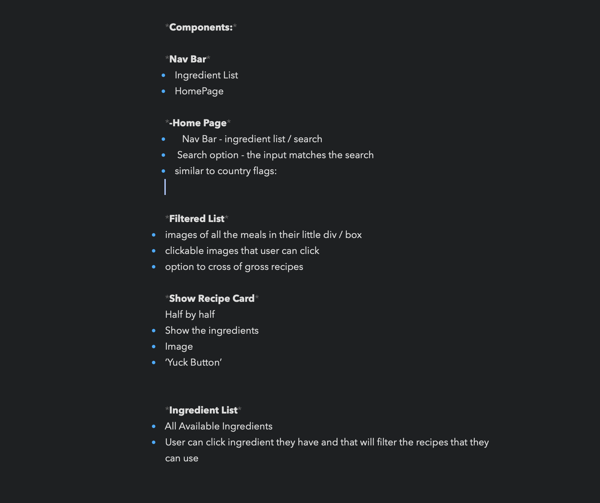
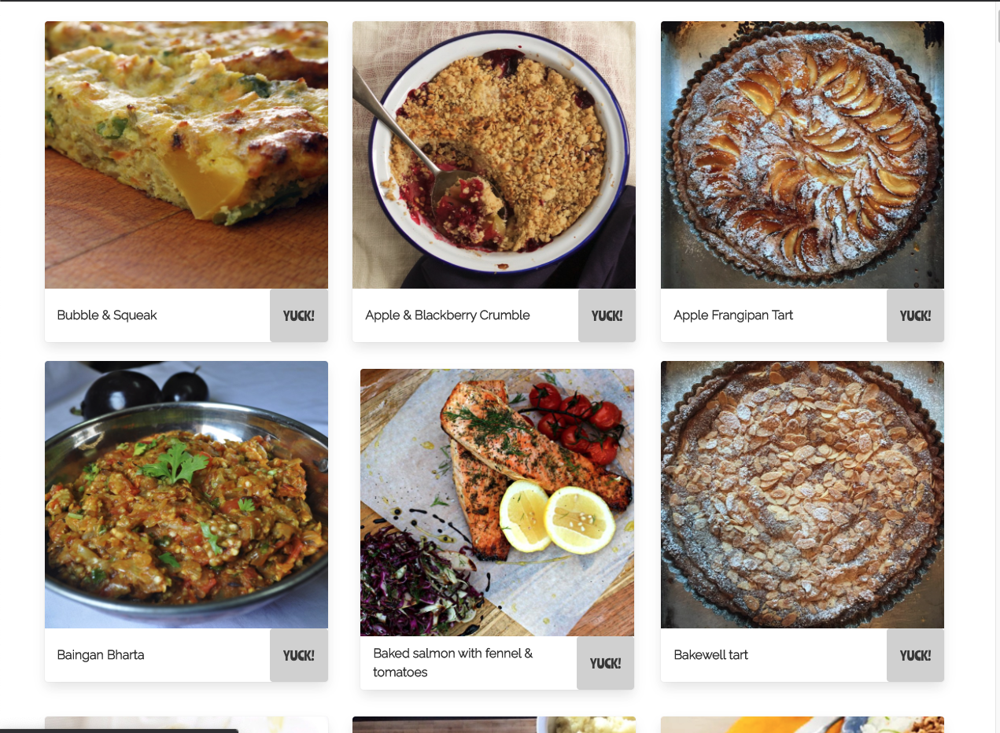
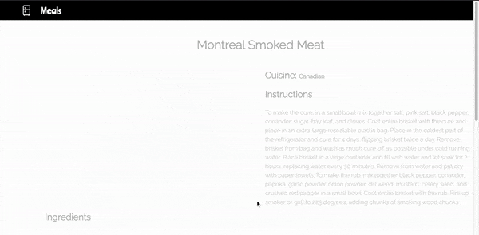
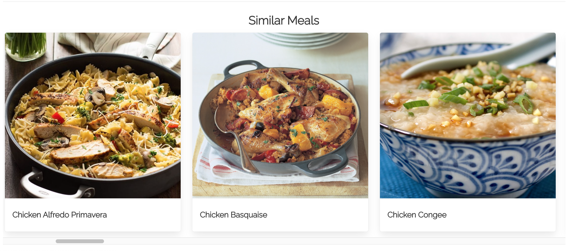

# Project 2 - What’s in your Fridge?


## Overview
For my second project at General Assembly we were given 48 hours to build a React app pair-coded with GA classmate.

This React app of are choice had to consume a public API and use a router with several components.

The main concept of our app was an app where users can search and find meals of their desire based on what’s in their fridge with the ingredients and steps in making the any meal they choose from the index provided. 

The app has been deployed with Netlify and is available [here](https://whats-in-ya-fridge.netlify.app/).

## Brief
* Consume a Public API
* Have several components - At least one classical and one functional
* The app should include the router - with several “pages
* Be deployed online and accessible to the public

## Collaborator
Elsie Down - [Github](https://github.com/elsiedown)

## Getting Started
1. Access the source code via the ‘Clone or download’ button
2. In CLI, run `yarn` on the root level to install dependencies
3. Run  `yarn start` to run program in your local environment


## Technologies Used
* React.js
* Javascript (ES6)
* HTML5
* SASS
*  [TheMealDB API](https://www.themealdb.com/)
* Axios
* Insomnia REST Client
* Yarn
* react-router-dom
* Bulma CSS Framework
* Google Chrome Dev Tools
* Google Fonts
* Es Lint
* Bear note
* Git 
* Github

## Demonstration of the App Flow 

<p style="text-align:center">
  
<p>

* The user starts at the homepage where the input box is shown asking what ingredient they have in their fridge.
* Upon typing an ingredient and submitting the search it takes the user to the index of meals with the ingredient it contains. 
* The user can then select a specific meal to see a detailed view of the meal with its instructions, ingredients and similar meals they like .
* Other key features: the user can click on the my fridge is full button found on the home page which takes the user to a random meal.
* In addition there is a yuck button that the user can click on to hide certain meals that they find disgusting.
* Lastly if the user types in an invalid ingredient there is an error page gif and message informing the user to try again.

## Process
After going through the Useful resources of **[Some free APIs](https://apilist.fun/)** we could use are interests lead us to go long the lines of a Food Based API, we decided to use the Mealdb which had multiple filtered requests that we wanted to use for are website and had a large enough list of meals to fufill the purpose of are app. 

Here are some more free Api resources we looked through:

* **[Some more free APIs](https://github.com/public-apis/public-apis)**
* **[Even more free APIs](https://dev.to/camerenisonfire/10-intriguing-public-rest-apis-for-your-next-project-2gbd)**
* **[The best free API Finder](https://www.google.com)**


## Plan 



We accumulated the resources needed and the dependencies we would like to include such as Bulma and Axios on Bear Notes.

Furthermore a breakdown of each of are major components and what the functionality of each component would look like.

When then moved on to testing the requests we wanted on insonmia to make sure it was showing results as expected and giving us a greater idea of what information we would like to show.
### Home and Index Page

<!--  -->

Then we started in implementing the search request of the meal db to are website by creating a form with an input search and using the input result as part of the request to mealdb api to output the results which is the index of meals that have the ingredient of what was submitted in the form.

```
import React from 'react'
import { useHistory } from 'react-router-dom'
function Home() {
  const [search, setSearch] = React.useState('')
  // let searchvalue = ''
  const history = useHistory()
  const handleFormSubmit = event => {
    event.preventDefault()
    history.push(`/meals?search=${search}`)
  }
  const handleFormChange = event => {
    setSearch(event.target.value)
  }
```

### Index View of Meals



For the index page we decided to keep the search bar at the top of the page so the user can change what they search without having to navigate back to the home page again. 

```
return (
    <section className="section column-slide">
      <div className="container meal-search">
        <form onSubmit={handleFormSubmit}>
          <input autoFocus 
            type="text"
            placeholder="Search Your Ingredient"
            value={search}
            onChange={handleFormChange}
          />
          <button className="button">Look for Meal</button>
        </form>
        <div className="columns is-multiline">
          {meals ?
            meals.map(meal => (
              <MealCard key={meal.idMeal} {...meal} />
            ))
            :
            hasError ? <ErrorCard /> :
              <h2 className="title has-text-centered">
               ...loading 
              </h2>
          }
        </div>
      </div>
    </section>
  )
}

```

### Show (Detailed View) Page

<!--  -->


With each meal card there was a link to the detailed show page of that specific meal using the id of the meal to uniquely identify each meal in the request we sent to the mealdb api.

```
import React from 'react'
import { Link } from 'react-router-dom'
function MealCategoryCard({ strMeal, strMealThumb, idMeal }) {
  return (
    <div className="column">
      <Link to={`/meals/${idMeal}`}>
        <div className="card size">
          <div className="card-image">
            <figure className="image image-is-1by1">
              
            </figure>
          </div>
          <div className="card-header">
            <div className="card-header-title">{strMeal}</div>
          </div>
        </div>
      </Link>
    </div>
  )
}
export default MealCategoryCard

```

On the detailed show page we then chose to show the ingredients, categories and instructions as well as the name and image using the MealDb and axios request.

```
function MealShow() {
  const [meals, setMeals] = React.useState('')
  const [categories, setCategories] = React.useState('')
  const [ingredients, setIngredients] = React.useState('')
  const similarMeals = categories.meals
  const { id } = useParams()
  React.useEffect(() => {
    const getData = async () => {
      try {
        const { data } = await axios.get(`https://www.themealdb.com/api/json/v1/1/lookup.php?i=${id}`)
        const { data: similarCategories } = await axios.get(`https://www.themealdb.com/api/json/v1/1/filter.php?c=${data.meals[0].strCategory}`)
        setIngredients(Object.keys(data.meals[0]))
        setMeals(data)
        setCategories(similarCategories)
        // console.log(Object.keys(meals.meals[0])
        console.log(ingredients)
      } catch (err) {
        console.log(err)
      }
    }
    getData()
  }, [id])
  return (
    <MealShowCard
      key={meals.idMeal}
      meals={meals}
      similarMeals={similarMeals} />
  )
}

```

In the Meal show card component we displayed the instructions and the ingredients mapped from the array of ingredients.


### Similar Meals Feature



In the Meal Show component we used the properties returned in a Meal Show request to output similar meals. Using the category property we were able to link lists of meals to its categories.

We made another request using the mealdb api to find all meals with a category specific to the meal id shown. Therefore providing us with an array of similar meals.

```
const similarMeals = categories.meals
  const { id } = useParams()
  React.useEffect(() => {
    const getData = async () => {
      try {
        const { data } = await axios.get(`https://www.themealdb.com/api/json/v1/1/lookup.php?i=${id}`)
        const { data: similarCategories } = await axios.get(`https://www.themealdb.com/api/json/v1/1/filter.php?c=${data.meals[0].strCategory}`)
        setIngredients(Object.keys(data.meals[0]))
        setMeals(data)
        setCategories(similarCategories)
        // console.log(Object.keys(meals.meals[0])
        console.log(ingredients)
      } catch (err) {
        console.log(err)
      }
    }
    getData()
  }, [id])

```

This was then passed down as a prop to then get displayed on the meal show page.

### “My Fridge is Full” (“Im feeling Lucky”) functionality
<!-- 
 -->

For the functionality for “My Fridge is Full” there was already a random meal request provided by mealdb so we just had to make an axios request. 
We decided to display it in the format of a meal show card to keep the website consistent.

```
function MealRandomShow() {
  const [meals, setMeals] = React.useState('')
  const [categories, setCategories] = React.useState('')
  const similarMeals = categories.meals
  React.useEffect(() => {
    const getData = async () => {
      try {
        const { data } = await axios.get('https://www.themealdb.com/api/json/v1/1/random.php')
        const { data: similarCategories } = await axios.get(`https://www.themealdb.com/api/json/v1/1/filter.php?c=${data.meals[0].strCategory}`)
        setMeals(data)
        setCategories(similarCategories)
      } catch (err) {
        console.log(err)
      }
    }
    getData()
  }, [])
  return (
    <MealShowCard 
      key={meals.idMeal}
      meals={meals}
      similarMeals={similarMeals} />
  )
}
```


### Error Handling 

<!--  -->


Moving on to the error handling of the search we decided to keep it on theme with what is in your fridge and display a gif related to a firdge being empty alongside an error message to try again.

### Styling and Animations

For the styling of the website we decided to go with Bulma css framework for the grid layout and the card layout on the meal show page.
Using bulma was very beneficial in making the website responsive as the bulma class names handles the responsiveness itself.

In addition we decided to go onto google fonts finding Raleway to use the font of our app.

Regarding the animations we simply used key frames to handle all our animations 

```
@keyframes slide-in {
  0% {
   top: -300px;
 }
 100% {
   top: 0;
 }
}
@keyframes fade-in {
  0% {
    opacity: 0;
  }
  100% {
    opacity: 1;
  }
}
@keyframes bounce {
  0% {
    opacity: 0;
    transform: translateX(100px);
  }
  60% {
    opacity: 0;
    transform: translateX(100px);
  }
  100% {
      opacity: 1;
      transform: translateX(0);
  }
}
@keyframes meal-bounce {
  0% {
    opacity: 0;
    transform: translateY(300px);
  }
  60% {
    opacity: 0;
    transform: translateY(300px);
  }
  100% {
      opacity: 1;
      transform: translateY(0);
  }
}

```


## Challenges
* API limitations: For features such as adding multiple ingredients to a user search the mealDb api didnt allow such requests without payment. Furthermore finding an API that had more meals to request were very hard to come by especially since we were looking for free ones.
* Timeframe: There were lots of quick breaks as we were consistently putting in the hours to make sure the website came out clean and on time. This was definitely a challenge but a rewarding one as we were able to see it through.
* Ingredients List: Displaying the ingredients list required creating an array from the object keys given from the MealDb API which was something I had never done before and took time to figure out.

## Wins
* Overall Site: Was very pleased with how the website looked with the animations and the professional layout of the meals and show page for the meals.
* Pair Programming Experience: Was a massive win being able to work with my partner, being able to learn from each other as well as learning together highlights why building this project 2 was a great experience.

## Future Features
* Improve the yuck functionality 
* Enabling users to save their favourite meals
* Add multiple ingredients to the search list in order for users to find meals more tailored to what they have in their fridge.

## What I learned
* How to use and manipulate data from a Public API
* Display data from the API through axios requests in a react app using CSS dependencies such as Bulma CSS framework
* How to apply animations and transitions using only keyframes.
* Pair programming - benefits of bouncing ideas off each other and learning from one another
* Time management in order to reach MVP within the short timeframe
* How to handle a Hackaton time pressured situation: with frequent short breaks and leaning on other people for help when needed.

